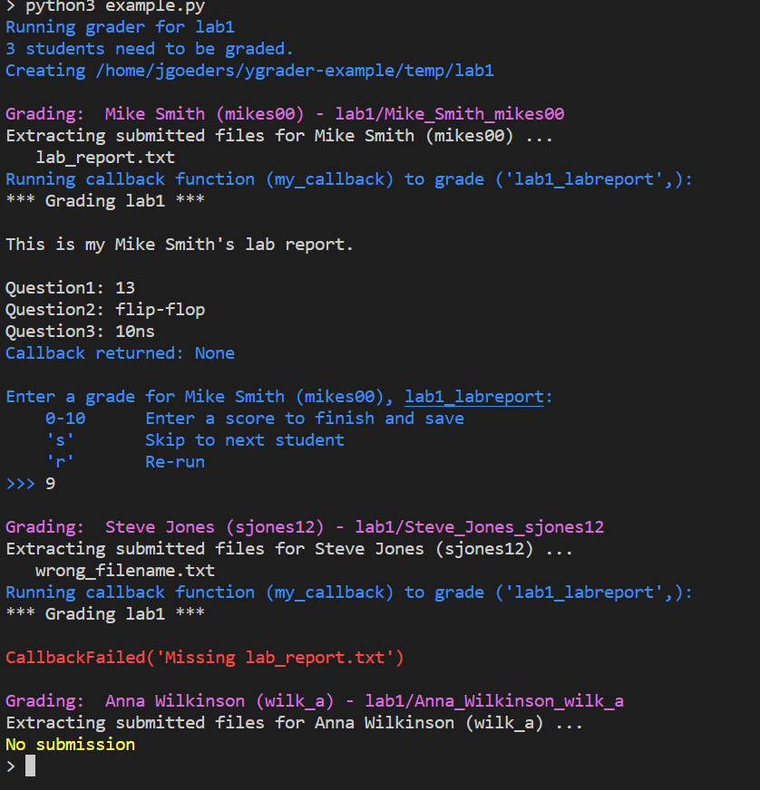

# Introduction


The package is designed to help you write grading scripts.  The main idea behind the package is that it removes all of the overhead that is common between grading different classes (extracting student code into their own folder, updating grade CSV files, etc.), and allows you to focus on just writing scripts for running student code in your class' environment.  This framework does not assume anything about the student's code structure; it should be equally helpful for grading hardware or software labs.

## Example

First install ygrader:

```bash
pip3 install ygrader
```

Then clone the example repository, available on [github](https://github.com/byu-cpe/ygrader-example), or download the [zip](https://github.com/byu-cpe/ygrader-example/archive/refs/heads/main.zip) and extract.

```
git clone https://github.com/byu-cpe/ygrader-example.git
```

An [example.py](https://github.com/byu-cpe/ygrader-example/blob/main/example.py) file is provided that shows how to run *ygrader*:

```python
import ygrader

def my_callback(student_code_path, lab_name, **kw):
    print("*** Grading", lab_name, "***\n")

    lab_report_path = student_code_path / "lab_report.txt"
    if lab_report_path.is_file():
        print(open(lab_report_path).read())
    else:
        raise ygrader.CallbackFailed("Missing lab_report.txt")


grader = ygrader.Grader(
    lab_name="lab1",
    grades_csv_path="learning_suite/grades.csv",
)
grader.add_item_to_grade("lab1_labreport", my_callback, max_points = 10)
grader.set_submission_system_learning_suite("learning_suite/lab1_submissions.zip")
grader.run()
```

In this example, the *lab1_submissions.zip* would have been batch downloaded from Learning Suite, and contains student submissions.  In this example, the student _Mike Smith_ submitted a lab report, while _Steve _Jones's submission was missing the _lab_report.txt_ file, and _Anna Wilkinson_ didn't submit anything.  

When you run the example, you should see the following interactive output:



This is an example of a very simple callback routine that just prints out a text file and asks the TA to enter a grade.  You can make your callbacks as complex as you want, such as compiling and running hardware or software, running simulations, or opening other programs.  You can have the TA enter a grade manually, or you can automatically calculate and return a grade from your callback function.

## Major Features

* The package can work with student files submitted using Learning Suite, *or* with student code on Github.  
* Grade multiple items at once (multiple columns in Learning Suite). This can allow you to run different tests, each worth a different number of points.
* Team-based assignments.
* Grades are updated in the CSV files as soon as you enter them, meaning you can Ctrl+C and kill the grading at any point, and re-run to continue where you left off.

## How to Use This
See [](usage.md)


